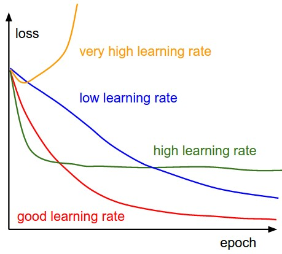
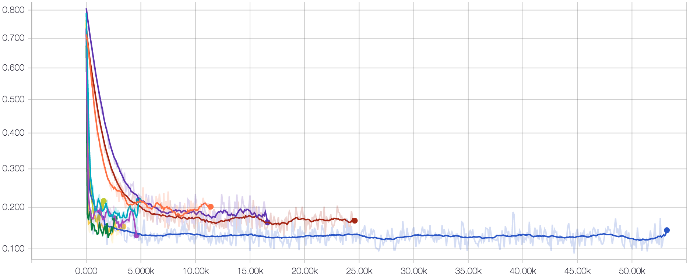

# Fine-tuning Inception-v3 from Scratch

[ImageNet](http://www.image-net.org/)을 학습한 [Inception-v3](https://github.com/tensorflow/models/tree/master/inception) 모델을 자신이 만든 이미지 데이터셋을 분류할 수 있도록 fine-tuning하는 법을 담은 글입니다.

> 이 글의 원문은 [tensorflow/models/inception](https://github.com/tensorflow/models/tree/master/inception)임을 밝힙니다.

## Prerequisites

### Install Anaconda & Bazel
* [Anaconda](https://www.continuum.io/downloads)
* [Bazel](https://bazel.build/versions/master/docs/install.html)

### Creating a conda environment for Inception
`inception`이라는 이름의 Python 2 환경 생성 후 활성화:
```sh
conda create -y -n inception python=2
source activate inception
```
TensorFlow 설치:
```sh
pip install tensorflow
# GPU를 사용할 경우
# pip install tensorflow-gpu
```
설치 확인:
```sh
python
>>> import tensorflow as tf
```
### Clone tensorflow/models repository

```sh
git clone git@github.com:tensorflow/models.git tensorflow-models
ln -s tensorflow-models/inception inception
cd inception
```

> ***NOTE*** (2017-03-21 기준) `tensorflow/models` repository를 TF 1.0 버전으로 올리는 작업중인 `update-models-1.0` branch가 아직 merging되지 않음.

TensorFlow 1.0 버전을 사용할 경우 `update-models-1.0` 브랜치를 체크아웃합니다.

```sh
git checkout origin/update-models-1.0
```

## Preparing my dataset

### Preparing image dataset

학습에 사용될 이미지를 포함한 디렉터리 `$TRAIN_DIR`와 validation에 사용될 이미지를 포함한 디렉터리 `$VAL_DIR`는 다음과 같은 구조를 가집니다:
```sh
$TRAIN_DIR/dog/image0.jpeg
$TRAIN_DIR/dog/image1.jpg
$TRAIN_DIR/dog/image2.png
...
$TRAIN_DIR/cat/weird-image.jpeg
$TRAIN_DIR/cat/my-image.jpeg
$TRAIN_DIR/cat/my-image.JPG
...
$VALIDATION_DIR/dog/imageA.jpeg
$VALIDATION_DIR/dog/imageB.jpg
$VALIDATION_DIR/dog/imageC.png
...
$VALIDATION_DIR/cat/weird-image.PNG
$VALIDATION_DIR/cat/that-image.jpg
$VALIDATION_DIR/cat/cat.JPG
...
```
정리하자면, `{SPLIT}/{LABEL}/*.{jpg, jpeg, png, JPG, JPEG, PNG}`와 같은 구조를 같게됩니다. 각 split 안의 디렉터리들은 label들로 이루어져 있으며, label 디렉터리 안에는 해당하는 이미지들이 들어있습니다.

> ***NOTE1*** JPG, PNG 모두 사용 가능하다고 나와 있지만, 제 경험에 따르면 PNG는 변환하는 과정에서 오류가 나는 경우가 있습니다. 또한, 너무 큰 크기의 이미지(가로 혹은 세로 길이가 1200이상 정도?) 또한 오류를 발생시키는 것 같습니다.

> ***NOTE2*** OSX에서 폴더에 `.DS_Store` 파일이 들어가지 않게 주의! (읽을 수 없는 JPEG 파일이라며 에러 발생)

다음은 실제 제가 테스트해본 데이터셋의 디렉터리 구조입니다:
```sh
$ tree $HOME/dataset/food/img
├── train
│   ├── gim
│   │   ├── gim_train_00001.jpg
│   │   ├── ...
│   │   └── gim_train_00012.jpg
│   └── tuk
│       ├── tuk_train_00001.jpg
│       ├── ...
│       └── tuk_train_00012.jpg
└── val
    ├── gim
    │   ├── gim_val_00001.png
    │   ├── gim_val_00002.jpg
    │   └── gim_val_00003.jpg
    └── tuk
        ├── tuk_val_00001.jpg
        ├── tuk_val_00002.jpg
        └── tuk_val_00003.jpg
```
`gim`은 김밥, `tuk`은 뚝배기입니다. 이미지의 이름은 무엇을 하든 상관이 없으나, 만약 특정 이미지가 오류를 발생시킬 경우 쉽게 찾기 위해 이름 형식을 모두 통일했습니다. OSX의 경우 여러 파일의 이름을 손쉽게 한번에 바꿀 수 있습니다.

### Preparing labels file
레이블에 대한 정보를 제공하는 `$LABELS_FILE`을 준비합니다. 이는 단순한 텍스트 파일로, 다음은 그 예시입니다:
```sh
gim
tuk
```
각 라인은 classifier 출력 결과의 인덱스에 해당합니다. 즉, 위의 경우 classifier의 예측 결과가 `1`이면 `gim`인 것이고, `2`이면 `tuk` 입니다. 참고로, `0`은 background class로 사용됩니다.

### Change information of the dataset
자신의 데이터셋에 맞게 `flowers_data.py`의 메소드들을 수정합니다.

* `num_classes()` 클래스의 수 (즉, `$LABELS_FILE` 파일의 라인 수)
* `num_examples_per_epoch()` training, validation 데이터셋 샘플의 수

위에 예시로 든 제 데이터셋의 경우 `flowers_data.py`을 다음과 같이 수정합니다:
```python
...
def num_classes(self):
  """Returns the number of classes in the data set."""
  return 2

def num_examples_per_epoch(self):
  """Returns the number of examples in the data subset."""
  if self.subset == 'train':
    return 24
  if self.subset == 'validation':
    return 6
...
```

## Preprocessing: image to TFRecords
학습을 하기 전에 먼저 자신의 데이터셋을 TFRecord 포멧으로 변환합니다.

```sh
DATA_DIR=<데이터셋 위치>

IMG_DIR=$DATA_DIR/img
TRAIN_DIR=$IMG_DIR/train
VALIDATION_DIR=$IMG_DIR/val

LABELS_FILE=$DATA_DIR/labels

OUTPUT_DIRECTORY=$DATA_DIR/tfrecord

mkdir -p $OUTPUT_DIRECTORY

# build the preprocessing script.
bazel build inception/build_image_data

# convert the data.
bazel-bin/inception/build_image_data \
  --train_directory="${TRAIN_DIR}" \
  --validation_directory="${VALIDATION_DIR}" \
  --output_directory="${OUTPUT_DIRECTORY}" \
  --labels_file="${LABELS_FILE}" \
  --train_shards=1 \
  --validation_shards=1 \
  --num_threads=1
```

* `train_directory` training 데이터셋 디렉터리
* `validation_directory` validation 데이터셋 디렉터리
* `output_directory` 변환된 TFRecord들을 저장할 디렉터리
* `labels_file` $LABELS_FILE 위치
* `train_shards` training 데이터셋 분할 수
* `validation_shards` validation 데이터셋 분할 수
* `num_threads` 전처리에 사용할 thread 수

`train_shards`와 `validation_shards`는 각각 training, validation 데이터셋을 총 몇 개로 분할하여 TFRecord 파일로 저장할 것인지 정하는 파라미터입니다. 너무 작으면 분할(shard) 하나의 크기가 너무 커서 메모리를 많이 차지하게 되고, 너무 크면 파일이 너무 많이 생성되어 . 분할 하나당 1024개의 이미지가 들어가면 적당합니다. 즉, `train_shards = num_train_examples / 1024`.

완료 후 제 디렉터리 구조는 이렇습니다:
```sh
$ tree $HOME/dataset/food
├── img
│   ├── train
│   │   ├── gim
│   │   │   ├── gim_train_00001.jpg
│   │   │   ├── ...
│   │   └── tuk
│   │       ├── tuk_train_00001.jpg
│   │       ├── ...
│   └── val
│       ├── gim
│       │   ├── gim_val_00001.png
│       │   ├── ...
│       └── tuk
│           ├── tuk_val_00001.jpg
│           ├── ...
├── labels
└── tfrecord
    ├── train-00000-of-00001
    └── validation-00000-of-00001
```

## Fine-tuning a pre-trained model on my dataset

### Download a pre-trained model
학습된 Inception-v3 모델을 다운로드합니다:
```sh
# location of where to place the Inception v3 model
mkdir -p models
cd models

# download the Inception v3 model
curl -O http://download.tensorflow.org/models/image/imagenet/inception-v3-2016-03-01.tar.gz
tar xzf inception-v3-2016-03-01.tar.gz
```
압축 해제 후 생성된 `inception-v3` 디렉터리는 다음과 같은 구조를 가져야합니다:
```sh
$ tree inception-v3/
├── checkpoint
├── model.ckpt-157585
└── README.txt
```

### Training
```sh
bazel build inception/flowers_train

# Path to the downloaded Inception-v3 model.
INCEPTION_MODEL_DIR=$(pwd)/models/inception-v3
MODEL_PATH="${INCEPTION_MODEL_DIR}/model.ckpt-157585"

# Directory where my data resides.
DATA_DIR=<데이터셋 위치>/tfrecord

# Directory where to save the checkpoint and events files.
TRAIN_DIR=$(pwd)/models/food

# Run the fine-tuning on the flowers data set starting from the pre-trained
# Imagenet-v3 model.
bazel-bin/inception/flowers_train \
  --train_dir="${TRAIN_DIR}" \
  --data_dir="${DATA_DIR}" \
  --pretrained_model_checkpoint_path="${MODEL_PATH}" \
  --fine_tune=True \
  --initial_learning_rate=0.01 \
  --batch_size=24
```

* `train_dir` 학습 기록과 학습된 모델을 저장할 디렉터리
* `data_dir` 데이터셋 디렉터리
* `pretrained_model_checkpoint_path` pre-trained 모델 디렉터리
* `fine_tune` fine-tuning 여부
* `initial_learning_rate` learning rate (아래의 `Empirically finding a good learning rate` 참고)
* `batch_size` 한번에 학습할 이미지의 수

> ***NOTE 1*** `batch_size`는 크면 좋지만, GPU 메모리는 한정되어 있습니다. `batch_size`를 줄이게 될 경우, learning rate 또한 함께 줄여야합니다.

> ***NOTE 2*** 예시에서는 `batch_size`가 24이지만, 이는 매우 작은 수 입니다. 보통 32, 64, 128, 256과 같은 값으로 정합니다.

> ***NOTE 3*** `batch_size`가 전체 학습 데이터 수보다 클 경우 학습이 잘 되지 않습니다. 예시의 `batch_size`가 24인 것은 이러한 이유 때문입니다.

위 스크립트로 학습을 실행하게 되면 10step 마다 현재 배치에서의 loss를 출력합니다. 또한, 100 step 마다 요약을 저장하여 후에 TensorBoard에서 볼 수 있도록하고, 5000 step 마다 모델을 저장하여 후에 학습된 모델을 불러올 수 있도록 합니다. 아래는 학습 출력 예시입니다:

```sh
...
2017-03-22 00:12:34.301729: step 40, loss = 0.76 (39.6 examples/sec; 0.606 sec/batch)
2017-03-22 00:12:40.134906: step 50, loss = 0.70 (38.5 examples/sec; 0.623 sec/batch)
2017-03-22 00:12:46.034960: step 60, loss = 0.69 (39.2 examples/sec; 0.612 sec/batch)
...
```

### Monitoring training using TensorBoard
```sh
tensorboard --logdir=models/food/
```
위 명령어 실행 후 브라우저에서 `http://<MY-SERVER-IP>:6006`을 열면 학습 과정을 실시간으로 감상하실 수 있습니다.

> ***NOTE*** 다른 터미널에서 TensorBoard를 실행할 경우 `source activate inception` 잊지마세요!

## Evaluation
본 섹션에서는 validation 데이터셋에 대해 성능을 평가하는 법을 설명합니다. 현재 저장된 모델(5000 step 간격으로 저장되는)을 불러와 단 한번 평가를 할 수도 있고, 주기적으로 수행할 수도 있습니다. 주기적으로 검증할 경우 그때 그때 가장 최근에 저장된 모델을 불러옵니다.

다음은 단 한번만 검증하는 스크립트입니다:
```sh
bazel build inception/flowers_eval

# Directory where my data resides.
DATA_DIR=<데이터셋 위치>/tfrecord

# Directory where we saved the fine-tuned checkpoint and events files.
TRAIN_DIR=$(pwd)/models/food

# Directory where to save the evaluation events files.
EVAL_DIR=$(pwd)/eval

mkdir -p $EVAL_DIR

# Disable using GPU
export CUDA_VISIBLE_DEVICES=""

# Evaluate the fine-tuned model on a hold-out of my dataset.
bazel-bin/inception/flowers_eval \
  --eval_dir="${EVAL_DIR}" \
  --data_dir="${DATA_DIR}" \
  --subset=validation \
  --num_examples=6 \
  --batch_size=6 \
  --checkpoint_dir="${TRAIN_DIR}" \
  --input_queue_memory_factor=1 \
 	--run_once
```
GPU를 사용하여 학습하는 동시에 GPU를 사용하여 evaluation을 시도할 경우 메모리 부족으로 에러가 발생할 수 있습니다. 따라서, `export CUDA_VISIBLE_DEVICES=""` 명령어로 GPU 사용을 금지하고 CPU만으로 연산을 수행하도록 합니다.

또한, 주기적으로 검증을 수행할 수도 있습니다. 다음은 5분 간격으로 검증을 수행하는 스크립트입니다.
```sh
bazel-bin/inception/flowers_eval \
  --eval_dir="${EVAL_DIR}" \
  --data_dir="${DATA_DIR}" \
  --subset=validation \
  --num_examples=6 \
  --batch_size=6 \
  --checkpoint_dir="${TRAIN_DIR}" \
  --input_queue_memory_factor=1 \
  --eval_interval_secs=300
```

## Empirically finding a good learning rate
학습 결과를 좌우하는 `hyperparameter`는 5-10개로 다양하지만, 처음부터 이를 모두 이해하고 조정하는 것은 어렵습니다. 본 섹션에서는 그 중 학습에 많은 영향을 미치는 learning rate를 조정하는 법에 대한 팁을 드립니다. Learning rate는 학습의 속도를 조정하는 hyperparameter로 크고 작음에 따라 학습에 다음과 같은 영향을 미칩니다:



> Source: [Stanford CS class CS231n: Convolutional Neural Networks for Visual Recognition](http://cs231n.github.io/neural-networks-3/)

위 그림에서 알 수 있듯이, learning rate가 정말 너무 크면(very high) loss가 발산해버립니다. 혹은 작으면(low) 학습이 너무 오래 걸리고, 오랜 시간이 지난 후에 high learning rate 보다 성능이 더 좋을 것이라는 보장도 없습니다. High learning rate의 경우 loss가 빠르게 줄어들긴하나, 성능에 한계가 있습니다.

결론은, 크지도 작지도 않은, 적당한 값의 learning rate를 실험을 통해 찾아야한다는 것입니다.

### Experiments for learning rate
보통 처음에는 learning rate에 크게 차이를 주며 조정하다가, 후에는 조금씩 미세하게 조정합니다. 예를 들면, 처음에는 `1.0, 0.1, 0.01, 0.001, 0.0001` 이런 식으로 조정하다가 `0.01`이 좋았다면, 다음에는 `0.05, 0.02, 0.01, 0.008, 0.005`와 같이 조정해볼 수 있습니다.

이렇게 learning rate 후보들을 동일한 step 만큼 학습하여 후에 TensorBoard로 비교할 수 있게 각각 다른 디렉터리에 학습 기록을 남깁니다. 이때 각각의 디렉터리에 사용된 hyperparameter들은 꼭! 기록을 해놓으셔야 합니다. 간단히 폴더 이름으로 구분할 수도 있지만, 많은 hyperparameter들을 조정하게 되면 다른 곳에 별도로 기록하시는게 좋습니다. 다음은 예시입니다:

```sh
├── lr0
├── lr1
├── lr2
├── lr3
├── lr4
```
`lr`은 learning rate, 뒤의 숫자는 소숫점 자리를 나타냅니다. 보통 TensorFlow 프로그램에서는 소수점 자리가 많은 경우 1e-4(=0.0001)와 같이 표기합니다.

각각의 학습 과정을 저장한 폴더들을 한곳에 모아 놓은 디렉터리에서 다음과 같이 TensorBoard를 실행하면, 하위 디렉터리들의 학습 기록을 동시에 보여줍니다.
```sh
tensorboard --logdir=.
```
아래 예시는 제가 여러 hyperparameter를 조정하며 진행했던 실험 기록입니다.

위와 같은 그래프를 보고 가장 좋았던 learning rate를 선택하여 실험을 진행하시면 됩니다.
